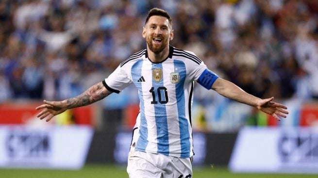

# EjercicioEntornosdeDesarollo
Practica4deEntornos
# FUTBOL 
## Mis 3 Selecciones favoritas para el mundial
1. Argentina:

    Encabezada por su jugador estrella y crack mundial **Leo Messi**
    

2. Brasil:

    El pais con ***mas copas del mundo*** en sus vitrinas, llevan tiempo
    sin estar al nivel de su pasado grandioso, pero este año tienen un equipazo.
    con Neymar y Vinicius sabemos que futbol no va a faltar en Qatar.
    
    
3. Francia:

    Actual campeona del mundo no viene en su mejor momento futbolístico y con muchos jugadores importantes
    lesionados, sobre todo en el centro del campo, pero tienen la mejor delantera para mí del mundial, hablamos
    de *Karim Benzema y Kilian Mbappe*, uno el actual balón de oro y otro dentro de poco futuro ganador del trofeo.
    

    ### 
    [Anuncio mundial Coca-cola](https://www.youtube.com/watch?v=FBoiDXp0XoU/) ⚽️⚽️⚽️

#### RESTO SELECCIONES FAVORITAS ####

| Selecciones | Cracks    |
|-------------|-----------|
| España      | Pedri     |
| Alemania    | Kimmich   |
| Uruguay     | Valverde  |
| Portugal    | Cristiano |
